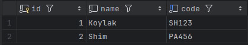
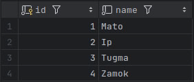
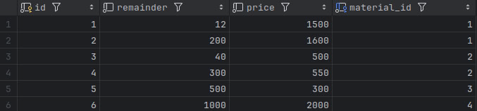
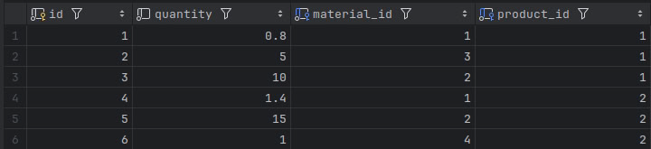

Принцип работы
Получение данных: API принимает данные о продуктах и их количествах.
Расчёт необходимых материалов: Для каждого продукта рассчитывается общее количество необходимых материалов.
Распределение по складам: API распределяет материалы по складам в порядке их появления. Если материал не полностью найден в складе, оставшееся количество будет указано с warehouse_id равным None.
Формирование ответа: Возвращается список материалов и их распределение по складам для каждого продукта.

Запрос POST /api/distribute-materials/
Тело запроса должно быть в формате JSON и содержать массив объектов с данными о продуктах:
Пример запроса
{
  "products": [
    {
      "product_name": "Koylak",
      "product_qty": 30
    },
    {
      "product_name": "Shim",
      "product_qty": 20
    }
  ]
}
Этот пример показывает, как сохранить данные для моделей Product, Material, Warehouse и ProductMaterials.
 - Product
 - Material
 - Warehouse
 - ProductMaterials